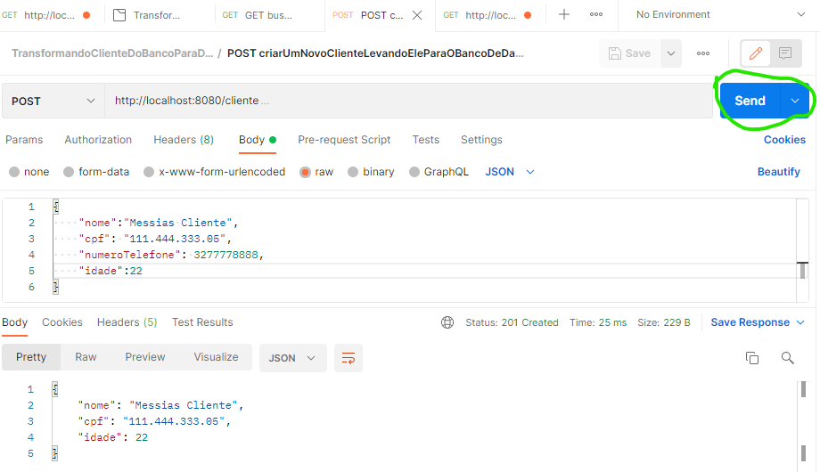
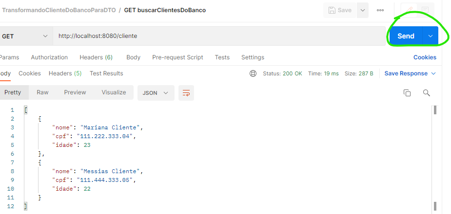
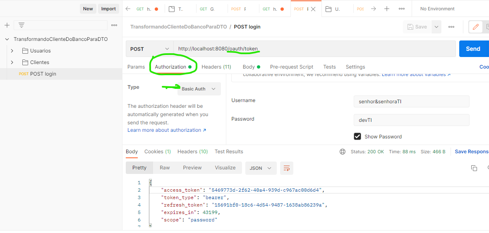
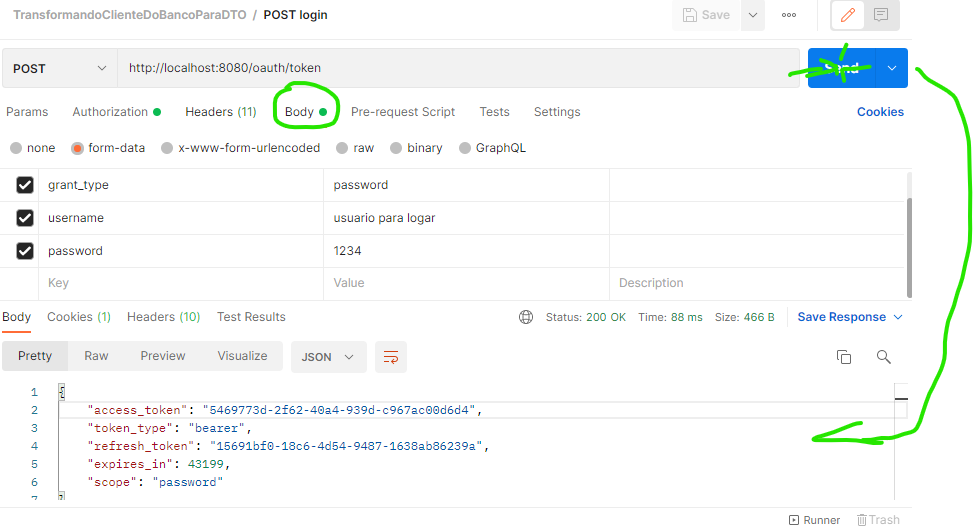
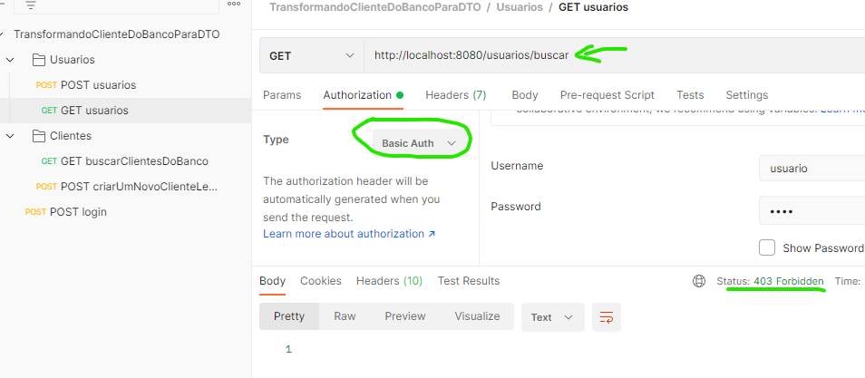

<H1> DTO - DATA TRANSFER OBJECT</H1>

>**O que é um dto?**
> > é um transformador de dados que vem do banco, ou vão para ele, em objeto.

>**Por que isso é importante?**
> > Em sua grande maioria, objeto que salvamos no banco de dados tem muitas informações desnecessarias para o saber do usuario,
> como por exemplo: data de inclusão, de alteração, identificador, coisas importantes para o banco que não são para o usuario final.
> Sabendo disso criamos o DTO para salvar no banco de dados todas informações necessarias e exibir para o usuario somente as que ele precisa.

>**Como fazemos essa conversão do banco para o usuario?**
> > Podemos usar alguns artificios como mostrei no service, lá, eu usei conversores, aqueles são basicos, por isso não recomendo, mas já da para trabalhar.

> **Como tudo isso acontece?**
> > pegamos dados do banco, transformamos ele para que o usuario entenda e seja legal para ele. Ou pode ser o inverso, pegamos as informações que precisamos do usuario e transformamos de maneira que o banco de dados aceite.

<h3>O que utilizamos no projeto:</h3>

 Tudo que foi utilizado aqui é pensando em programadores iniciantes, que estão começando agora na area da programação.

O projeto foi separado em alguns arquivos, dentre eles:

<h3>Criação de novos clientes no banco de dados:</h3>

Veja, eu insiro os dados e quando executo o send ele me salva no banco e me retorna um DTO com a resposta do que foi salvo.

<h3>Busca por clientes no banco de dados</h3>
Veja que nas linhas o que nos traz.  

>**Controller:**
> estes são responsaveis pela chamada do front end, ou seja, o controlador e gerente do projeto, é ele que vai dizer onde buscar.

>**Service:**
> Onde estão localizadas as logicas e toda funcionalidade do nosso projeto.

>**Entity:**
>São as entidades do projeto, aqui são os dados explicitos que vão ser inseridos no banco de dados.

>**Repository:**
> é o que vamos chamar para acessar nosso banco de dados.

>**DTO:**
>Classes responsavel por fragmentar o Entity, objeto que o usuario final precisa conhecer.

<h3>JSON UTILIZADO NO POSTMAN</h3>

~~~json
{
  "info": {
    "_postman_id": "ec7316f7-a68b-420a-ab80-1cd5fb6984d8",
    "name": "TransformandoClienteDoBancoParaDTO",
    "schema": "https://schema.getpostman.com/json/collection/v2.1.0/collection.json"
  },
  "item": [
    {
      "name": "Usuarios",
      "item": [
        {
          "name": "POST usuarios",
          "request": {
            "auth": {
              "type": "noauth"
            },
            "method": "POST",
            "header": [],
            "body": {
              "mode": "raw",
              "raw": "{\r\n    \"nome\": \"usuario para logar\",\r\n    \"senha\": \"1234\"\r\n}",
              "options": {
                "raw": {
                  "language": "json"
                }
              }
            },
            "url": {
              "raw": "http://localhost:8080/usuarios",
              "protocol": "http",
              "host": [
                "localhost"
              ],
              "port": "8080",
              "path": [
                "usuarios"
              ]
            }
          },
          "response": []
        },
        {
          "name": "GET usuarios",
          "request": {
            "auth": {
              "type": "bearer",
              "bearer": [
                {
                  "key": "token",
                  "value": "5469773d-2f62-40a4-939d-c967ac00d6d4",
                  "type": "string"
                }
              ]
            },
            "method": "GET",
            "header": [],
            "url": {
              "raw": "http://localhost:8080/usuarios/buscar",
              "protocol": "http",
              "host": [
                "localhost"
              ],
              "port": "8080",
              "path": [
                "usuarios",
                "buscar"
              ]
            }
          },
          "response": []
        }
      ]
    },
    {
      "name": "Clientes",
      "item": [
        {
          "name": "GET buscarClientesDoBanco",
          "request": {
            "auth": {
              "type": "bearer",
              "bearer": [
                {
                  "key": "token",
                  "value": "5469773d-2f62-40a4-939d-c967ac00d6d4",
                  "type": "string"
                }
              ]
            },
            "method": "GET",
            "header": [],
            "url": {
              "raw": "http://localhost:8080/cliente",
              "protocol": "http",
              "host": [
                "localhost"
              ],
              "port": "8080",
              "path": [
                "cliente"
              ]
            }
          },
          "response": []
        },
        {
          "name": "POST criarUmNovoClienteLevandoEleParaOBancoDeDados",
          "request": {
            "auth": {
              "type": "bearer",
              "bearer": [
                {
                  "key": "token",
                  "value": "5469773d-2f62-40a4-939d-c967ac00d6d4",
                  "type": "string"
                }
              ]
            },
            "method": "POST",
            "header": [],
            "body": {
              "mode": "raw",
              "raw": "{\r\n    \"nome\":\"cliente\",\r\n    \"cpf\": \"111.444.333.05\",\r\n    \"numeroTelefone\": 3277778888,\r\n    \"idade\":22\r\n}",
              "options": {
                "raw": {
                  "language": "json"
                }
              }
            },
            "url": {
              "raw": "http://localhost:8080/cliente",
              "protocol": "http",
              "host": [
                "localhost"
              ],
              "port": "8080",
              "path": [
                "cliente"
              ]
            }
          },
          "response": []
        }
      ]
    },
    {
      "name": "POST login",
      "request": {
        "auth": {
          "type": "basic",
          "basic": [
            {
              "key": "password",
              "value": "devTI",
              "type": "string"
            },
            {
              "key": "username",
              "value": "senhor&senhoraTI",
              "type": "string"
            }
          ]
        },
        "method": "POST",
        "header": [
          {
            "key": "Authorization",
            "value": "",
            "type": "text",
            "disabled": true
          }
        ],
        "body": {
          "mode": "formdata",
          "formdata": [
            {
              "key": "grant_type",
              "value": "password",
              "type": "text"
            },
            {
              "key": "username",
              "value": "usuario para logar",
              "type": "text"
            },
            {
              "key": "password",
              "value": "1234",
              "type": "text"
            }
          ]
        },
        "url": {
          "raw": "http://localhost:8080/oauth/token",
          "protocol": "http",
          "host": [
            "localhost"
          ],
          "port": "8080",
          "path": [
            "oauth",
            "token"
          ]
        }
      },
      "response": []
    }
  ]
}
~~~
<h2>APLICANDO SEGURANÇA NO PROJETO</h2>

Aqui aplicamos a segurança do projeto, adicionamos as dependencias do 
spring security e oauth 2 no pom.xml

>Arquivo configuração de segurança:
>
> **ConfiguracaoDeSeguraca**
> > configure(HttpSecurity http): este metodo é responsavel por dizer quais URL's estão liberadas e para quem.

> > configure(AuthenticationManagerBuilder auth): este metodo é responsavel por localizar o userDatailService e analisar se ele existe e esta Ok para o login.

> > configure(WebSecurity web): este metodo é responsavel por dizer quais urls o spring security não precisa analisar.

<h4>**Configuração de segurança atualizada**<h4>
LOCAL--> ConfiguracaoSegurancaAtualizado
>substituindo configure(HttpSecurity http):
> > Para substitui-lo utilizamos filterChain que retorna um SecurityFilterChain e recebe como parametro um HttpSecurity 
  OBS: utilizamos no retorno o nome da variavel http.build() (varivavel é http por exemplo)
assim ele vai retornar o build que você fez.
>
> substituindo configure(AuthenticationManagerBuilder auth)
> > Este no caso é somente usarmos o password ecoder com o bean que ele ja vai buscar o usuario logado na aplicação, pois o usuario logado vai ser gerenciado por um bean do spring, neste caso o @Service, então o proprio spring ja entende.
>
> sustituindo o configure(WebSecurity web)
> > public WebSecurityCustomizer webSecurityCustomizer()   Com este metodo podemos fazer uma lambda expression e retornar o proprio web que vai chegar para ele com os antMatcher que queremos ignorar como mostra no codigo.

<h4>LOGANDO NA APLICAÇÃO</h4>
Para logarmos na aplicação vamos utilizar a url /oauth/token
  É um padrão que utilizamos quando trabalhamos com oauth2.

 <b>INFORMAÇÕES DA APLICAÇÃO</b>

<b>INFORMAÇÕES DO USUARIO</b>

>Obs: scope tem que ser == ao password, isso foi setado nas configurações do oauth

<h2 style ="color:green">ACCESS TOKEN</h2>
o access token gerado após logarmos na aplicação, para ter acesso as funcionalidades, você precisa incluir o acess token no bearer dentro do Authorization do postman. Ou seja, pega o access gerado e coloca no bearer da requisição.

<b>CONFIGURAÇÔES DO OAUTH</b> 
as configurações do oauth se localiza no application.properties
sempre que sobe a aplicação ele le o application

<h2>CONFIGURAÇÃO SEM OAUTH2</h2>
> Passamos nosso login e senha para qualquer requisição que queremos fazer, através do basic Auth.
> 
> veja: em cada requisição mostramos quem quer ter acesso, se o perfil for admin ele vai poder acessar esse get, como ele não é ai teve o erro 403

<h3 style="color:green"> Mostramos 2 maneiras simples de aplicar segurança, uma com o oauth, porem esta sem roles e a outra com spring security tradicional aplicando algumas roles no user.</h3>